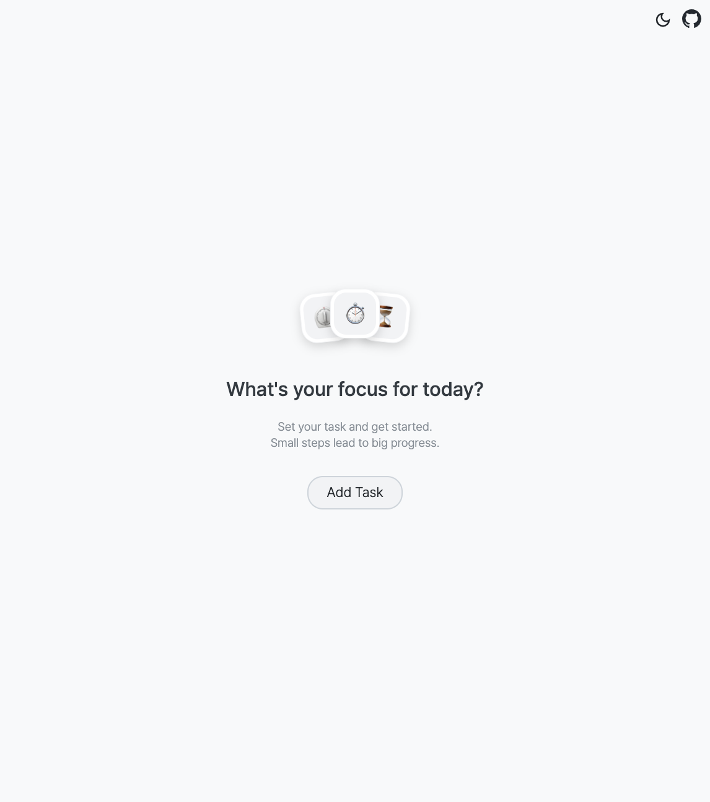
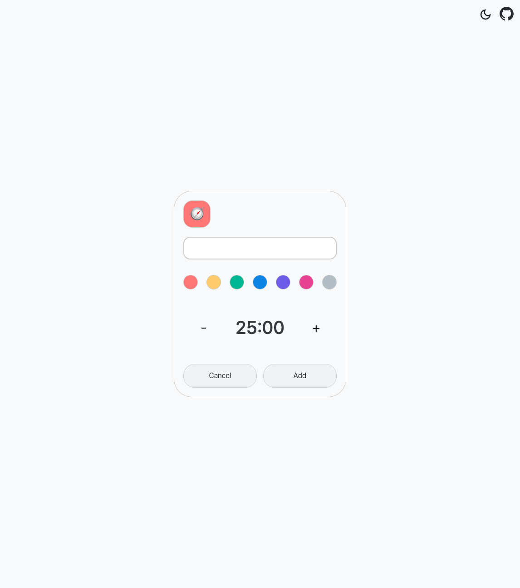
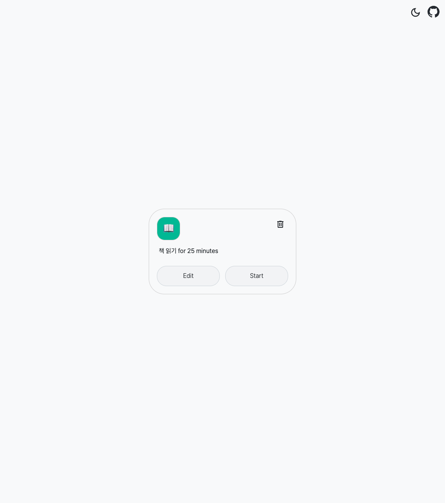
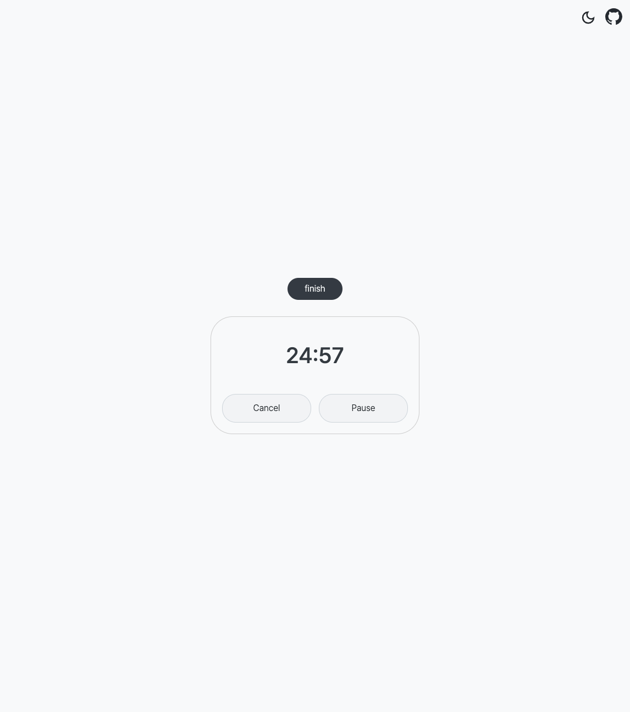

# Pomodoro Timer

> 🔗 배포 URL: https://ckdgus1010.github.io/pomodoro_timer/

## 🔍 개요

- Pomodoro 기법 기반의 타이머 웹 애플리케이션
- 집중 시간과 휴식 시간을 설정하고, 할 일을 등록할 수 있음
- 효율적인 시간 관리를 돕는 데 목적을 둠

### ✅ 개발 정보

- **프로젝트 기간**: 2025.09.01 ~ 2025.09.08
- **개발 방식**: 개인 프로젝트

### 🛠️ 기술 스택

- React, TypeScript, Jotai, styled-components

## ⚙️ 주요 기능

### 📝 할 일 관리

- 할 일을 1개 등록할 수 있는 간단한 To-Do 기능 제공
- 등록된 할 일은 Local Storage에 저장되어 새로고침 후에도 유지됨
- 등록된 할 일은 수정 및 삭제 가능

### ⏱️ 타이머 기능

- Pomodoro 타이머
    - 기본 설정: 25분 집중 / 5분 휴식
- 집중 및 휴식 시간 분 단위로 조정 가능
    - 집중 시간: 15 ~ 35분
    - 휴식 시간: 1 ~ 15분
- 타이머 제어 기능
    - 일시정지(Pause)
    - 재시작(Restart)
    - 완료(Finish)
    - 취소(Cancel)

### 🎨 다크 모드 지원

- 사용자 환경에 따라 다크 / 라이트 테마 전환 가능

## 🖼️ 화면 소개

| 🏠 홈 화면 |   |
|---------|---|
||- Local Storage에 저장된 할 일이 없으면 표시되는 화면|

| 📝 할 일 등록 화면 |   |
|---------|---|
||- 할 일을 1개 등록할 수 있음 - 집중 시간 설정 가능 &nbsp;&nbsp;- 기본: 25분 &nbsp;&nbsp;- 변경 가능 범위: 15 ~ 35분|

| 🔍 할 일 보기 화면 |   |
|---------|---|
||- 등록한 할 일을 확인할 수 있는 화면 - Local Storage에 저장된 할 일이 있으면, 이 화면이 표시됨 - [Start] 버튼: 타이머 시작 - [Edit] 버튼: 할 일 수정 - [Delete] 버튼: 할 일 삭제|

| ⏳ 타이머 화면 |   |
|---------|---|
||- 사용자가 지정한 시간(집중 또는 휴식)동안 작동 - [Pause] 버튼: 일시 정지 - [Cancel] 버튼: 타이머 취소 - [finish] 버튼: 타이머 종료 또는 스킵|

| 🎉 휴식 타이머 설정 화면 |   |
|---------|---|
||- 휴식 시간을 설정하는 화면 &nbsp;&nbsp;- 기본: 5분 &nbsp;&nbsp;- 변경 가능 범위: 1 ~ 15분|